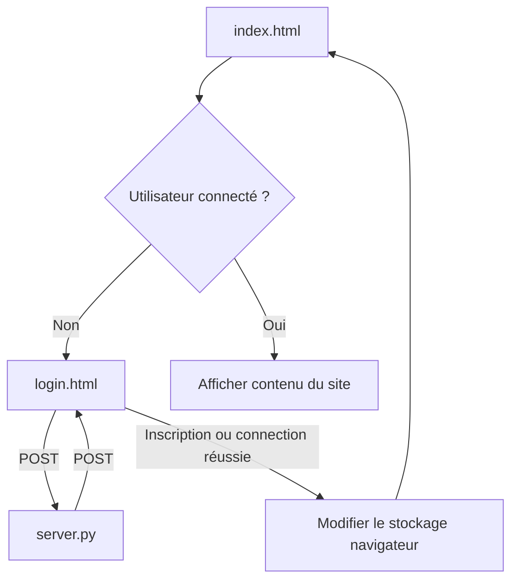

# SYNK

- [Fonctionnement](#fonctionnement)
  - [Connection]()

---

## Fonctionnement

### Connection

Pour la connection ou la création d'un compte : lorsque le formulaire dans `login.html` ou `register.html` est complété, les scripts associés vont envoyer une requête `POST` à `server.py` qui créera un compte ou cherchera dans la base de donnée si ce compte existe avec le bon mot de passe.
S'il existe, le nom d'utilisateur est mis dans le stockage temporaire du navigateur et l'utilisateur est envoyé vers la page `index.html`, sinon, un message d'erreur s'affiche.
