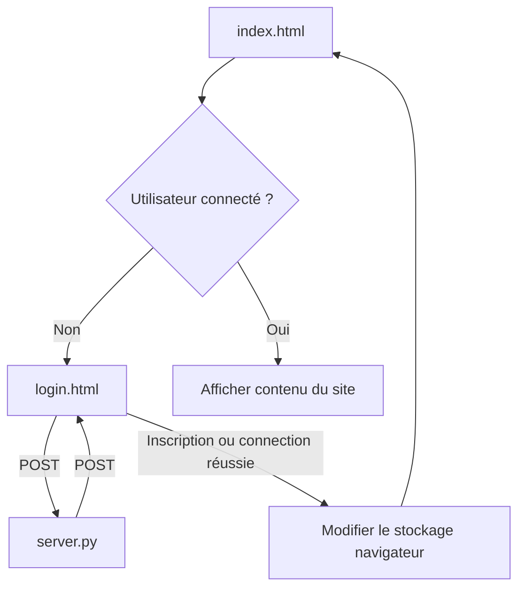
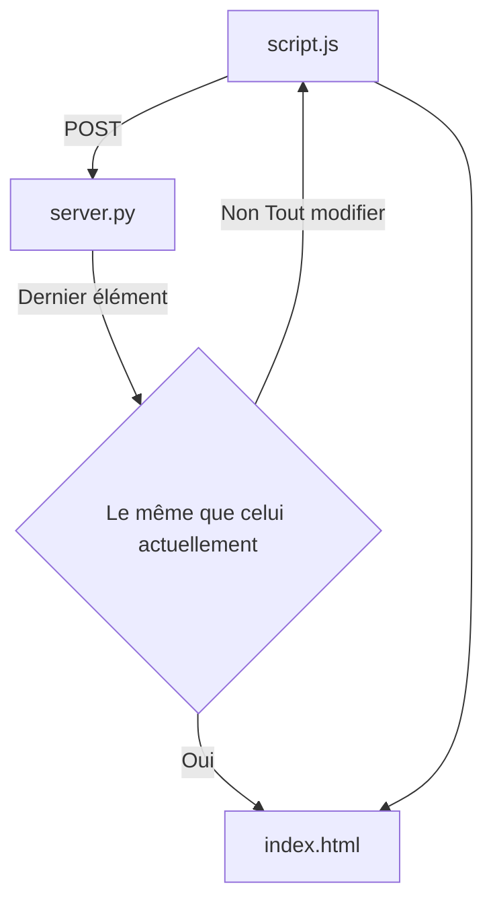

# SYNK

- [Fonctionnement](#fonctionnement)
  - [Connection](#connection)
  - [Actualisation du contenu](#actualisation-du-contenu-de-la-page)
    - [Contacts](#contacts)
    - [Messages](#messages)
  - [server.py](#serverpy)
- [Utilisation](#utilisation)
---

## Fonctionnement

### Connection

Pour la connection ou la création d'un compte : lorsque le formulaire dans `login.html` ou `register.html` est complété, les scripts associés vont envoyer une requête `POST` à `server.py` qui créera un compte ou cherchera dans la base de donnée si ce compte existe avec le bon mot de passe.
S'il existe, le nom d'utilisateur est mis dans le stockage temporaire du navigateur et l'utilisateur est envoyé vers la page `index.html`, sinon, un message d'erreur s'affiche.

---

### Actualisation du contenu de la page

L'actualisation du contenu de la page se passe dans la fonction [main](https://github.com/nathan-004/social-network/blob/main/js/home.js#L512) dans `home.js` qui est appelée toute les 350ms.  

#### Contacts

Pour les demandes de contacts sur la droite de l'application ou les contacts affichés sur la barre de gauche, c'est le même fonctionnement :

D'abord, `home.js` demande le dernier élément (contact, demandes de contacts) à `server.py` puis regarde si c'est le même que celui qui est déjà sur la page. Si c'est le même, il ne modifie pas les valeurs, sinons, il demande toutes les valeurs à `server.py` puis actualise `index.html`.

#### Messages

Pour l'actualisaton des messages c'est la même chose sauf qu'il faut avant regarger quel est le contact qui a été sélectionné pour savoir quelles messages il faut afficher.

---

### server.py

`server.py` utilise [Flask](https://flask.palletsprojects.com/en/stable/) pour envoyer et recevoir des données de `home.js`. Il existe plusieurs points d’entrée sur le serveur accessibles via la méthode POST (tous utilisent `database.py` qui modifie ou retourne les données de deux tables SQL (user et messages) en utilisant `sqlite3`).

## Utilisation

Pour utiliser SYNK, il faut d'abord lancer `server/server.py` pour permettre l'envoie de données d'authentification, de contacts, de messages, etc..
Ensuite il faut ouvrir `index.html` sur un navigateur (sauf Firefox, problème de redirection vers `index.html` lors de la connection).
Une fois connecté, vous pouvez utiliser le site et communiquer avec d'autres utilisateurs.

